# Deploying Azure Functions using VSTS

## Overview
<!---
Azure Functions is a [serverless](https://azure.microsoft.com/overview/serverless-computing/) compute service that enables you to run code on-demand without having to explicitly provision or manage infrastructure. We can have Azure Functions to run a script or piece of code in response to a variety of events.

OR --->

Azure Functions is an event driven, compute-on-demand experience that extends the existing Azure application platform with capabilities to implement the code triggered by events occurring in Azure or third-party service as well as on-premises systems. Azure Functions allows developers to take action by connecting to data sources or messaging solutions thus making it easy to process and react to events. Developers can leverage Azure Functions to build HTTP-based API endpoints accessible by a wide range of applications, mobile and IoT devices.
 
**Scenario for the lab:** In this lab, we are using a fictional eCommerce website - PartsUnlimited. The PartsUnlimited team decides to roll out a new feature called **special discount for *employees of PartsUnlimited*** and a **different discount for *general users***. In this lab, we will implement a .Net Core Web API which will contain information about products and price (including discounts) and an Azure Functions which acts as a switching mechanism to return different (discount) information based on the user logged in to the application.

 ## What is covered in this lab?

 In this lab, you will

* Create a Visual Studio Team Services account
* Clone the PartsUnlimited project from GitHub
* Setup Azure Function in Azure portal
* Create a Azure Functions project in Visual Studio

* Setup a build definition in VSTS to build and test the code
* Configure a CD pipeline in VSTS for Website, API and Azure Functions

## Setting up the environment

### Part A: Provision the required Azure resources
1. Open Internet Explorer from the taskbar.
1. Navigate to [https://portal.azure.com](https://portal.azure.com)
1. Login with the following username and password user165842@cloudplatimmersionlabs.onmicrosoft.com  Dx-$V{#.:Sy+ and click Sign in


1. Open a new tab in internet explorer and enter https://goo.gl/octfDu
to open an ARM template for creating required App Services.
1. For the **Resource Group** field, select **Use exisiting** and pick @lab.Resource group from the dropdown

1. Agree to the Terms and conditions and click Purchase. It should take approximately 1-2 minutes to provision the resources. Once the deployment is successful, you will see the resources as shown.
   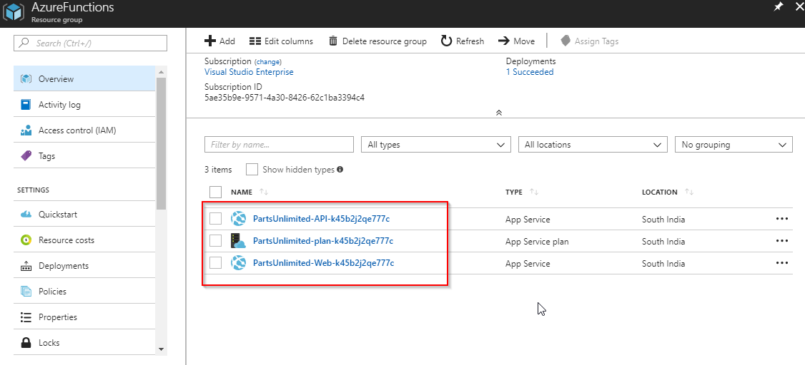
  
  ### Part B: Create VSTS account
  1. Navigate to https://www.visualstudio.com/team-services/ in a separate tab. Select **Get Started for Free**.
  1. You can use the same credentials used above to log in to Azure
  
  1. Provide a name for your VSTS account and click Continue to start the creation process
  1. In 1-2 minutes your account should be ready with a default project **MyFirstProject** created.

### Part C: Import and clone the project repository

1. Navigate to the **Code** hub. As you have not created any code yet you should see an empty repository. You can clone the remote repository to your local machine and start adding code. You can also import code from an another repository if you have existing code. For the purpose of this lab we will import it from GitHub.
1. Select **import** and enter https://github.com/sriramdasbalaji/AzureFunctionsBuild.git in the Clone URL field and select **Import**


     

      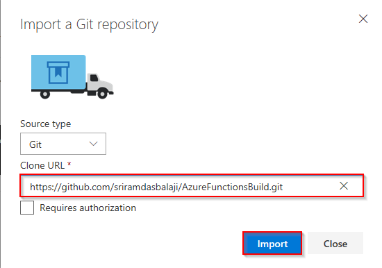

1. When the import is complete, you can clone it and open it in Visual Studio(or any other IDE). We will use Visual Studio. Select **Clone** and then select **Clone in Visual Studio**.

   

1. When the code open in Visual Studio, if you are prompted to sign into VSTS use the same credentials that you used to create account above

4. Select **Clone**.

     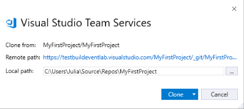


5. In Team Explorer under **Solutions**, you will see **PartsUnlimited.sln** available in the local git folder. Double click on **PartsUnlimited.sln** to open the project.

     


## Exercise 1:  Set up an Azure Function

Azure Functions App is the container that hosts the execution of individual functions. A function app lets you group functions as a logic unit for easier management, deployment, and sharing of resources. In this exercise, you will create **Azure Function App** from Azure portal and then you will create **Azure Functions project** in PartsUnlimited Solution using Visual Studio.

The [Azure Functions](https://azure.microsoft.com/en-in/services/functions/) created in this exercise will act as a switching proxy or mechanism to return different (discount) information based on the user logged in to the application.
Although we have used a simple condition here, this could also use more complex rules which could potentially be hidden behind another web api call.

1. Navigate to the Azure portal https://portal.azure.com

2. Click on **Resources Groups**, select the resource group. In **Overview** page select **Add**.

   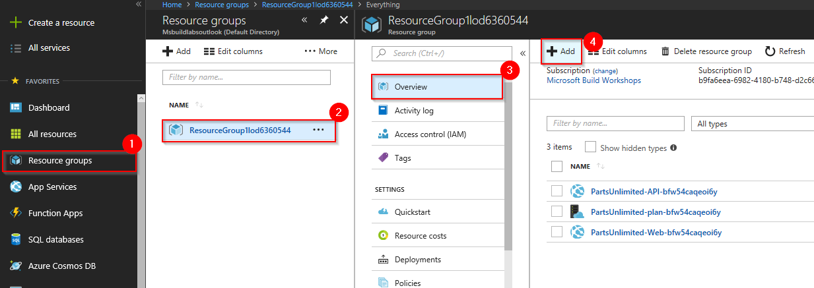

3. Filter down options by typing **Function App**, click on **Function App** option, then select **Create**.

    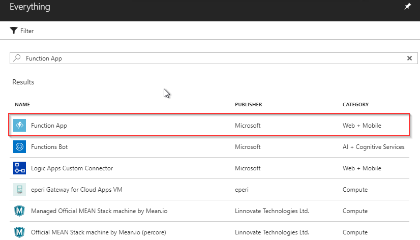

4.  Enter a name for your Function App, choose your subscription, select **App Service Plan** as your **Hosting plan** and click on **Create**.

    

5. Navigate to the resource group where you added your Azure function and click on it.

    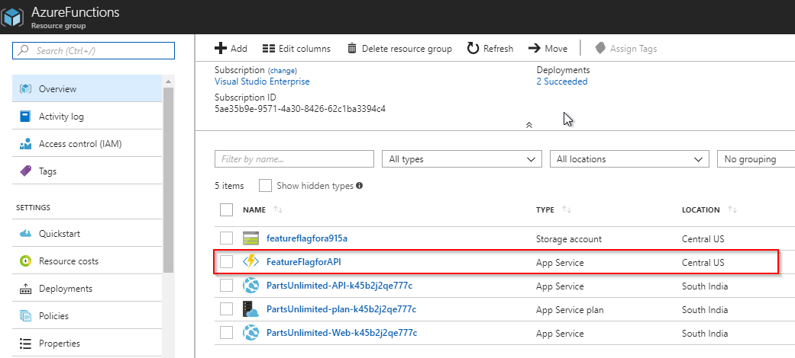

   You will see Function App is deployed successfully and status of the app as *Running*

   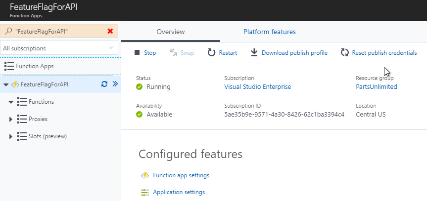

   
6. Select **Functions** in your function app and click on Add icon. Select **create your own custom function**. Then click on **Create this function**.

   
  
7. Select **HTTP trigger**.

    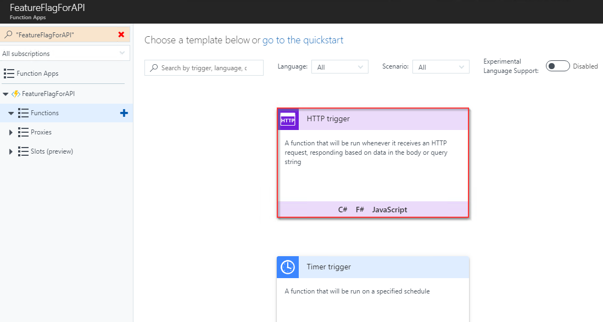

    Enter the details as shown below and click on Create. Select language as **C#** and  for Name enter **SpecialsProxy**

    

8. Once the Function is created, select the Function and click on **Get Function Url**
   
   

   Copy the URL and save to notepad. You will need this URL later on.

   

9. Now you will create **Azure Functions Project** using Visual Studio in PartsUnlimited solution. Then you will build and deploy Azure Functions using VSTS. In this Azure Functions Project, you will write code to redirect the API v1/v2 based on the user login. Open the **Visual Studio**.
Right click on solution, select **Add** and select **New Project**.

   

10. Select **Cloud** under **Visual C#** category, select **Azure Functions** as the type of this project, enter **PartsUnlimited.AzureFunction** into the name field and append **\src** at the end of the location, then click on "OK".

     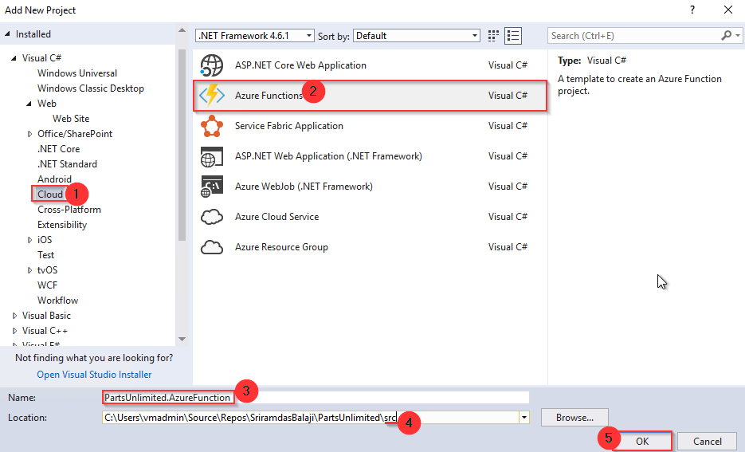

     Select **HttpTrigger** template and click on **OK**
    

    

11. Expand the **PartsUnlimited.AzureFunction** project, right click on **Function 1.cs** and select **Rename**. Rename the file as **SpecialsProxy**

    

12. Open the **SpecialsProxy.cs** file, replace the existing code with the following code.
 ```csharp
using System;
using System.Linq;
using System.Net;
using System.Net.Http;
using System.Threading.Tasks;
using Microsoft.Azure.WebJobs;
using Microsoft.Azure.WebJobs.Extensions.Http;
using Microsoft.Azure.WebJobs.Host;

namespace PartsUnlimited.AzureFunction
{
    public static class SpecialsProxy
    {
        [FunctionName("SpecialsProxy")]
        public static async Task<HttpResponseMessage> Run([HttpTrigger(AuthorizationLevel.Function, "get", "post", Route = null)]HttpRequestMessage req, TraceWriter log)
        {
            var userIdKey = req.GetQueryNameValuePairs().FirstOrDefault(q => string.Equals(q.Key, "UserId", StringComparison.OrdinalIgnoreCase));
            var userId = string.IsNullOrEmpty(userIdKey.Value) ? int.MaxValue : Convert.ToInt64(userIdKey.Value);
            var url = $"https://YourAppServiceUrl.azurewebsites.net/api/{(userId > 10 ? "v1" : "v2")}/specials/GetSpecialsByUserId?id={userId}";
            using (HttpClient httpClient = new HttpClient())
            {
                return await httpClient.GetAsync(url);
            }
        }
    }
}
```
>Replace YourAppServiceUrl in url variable with URL for the App Service with your API.


13.  Open StoreController located at PartsUnlimitedWebsite > Controllers > StoreController.cs

     

2. Replace the code with the following snippet
  ```csharp
  // Copyright (c) Microsoft. All rights reserved.
// Licensed under the MIT license. See LICENSE file in the project root for full license information.
using Microsoft.AspNetCore.Mvc;
using Microsoft.Extensions.Caching.Memory;
using PartsUnlimited.Models;
using System;
using System.Linq;
using System.Collections.Generic;
using System.Net.Http;
using System.Threading.Tasks;
using Newtonsoft.Json;
namespace PartsUnlimited.Controllers
{
    public class StoreController : Controller
    {
        private readonly IPartsUnlimitedContext _db;
        private readonly IMemoryCache _cache;

        public StoreController(IPartsUnlimitedContext context, IMemoryCache memoryCache)
        {
            _db = context;
            _cache = memoryCache;
        }

        //
        // GET: /Store/

        public IActionResult Index()
        {
            var category = _db.Categories.ToList();

            return View(category);
        }

        //
        // GET: /Store/Browse?category=Brakes

        public async Task<IActionResult> Browse(int categoryId)
        {
            // Retrieve category and its associated products from database
            // TODO [EF] Swap to native support for loading related data when available
            var categoryModel = _db.Categories.Single(g => g.CategoryId == categoryId);

            if (categoryModel.Name.ToLower().Equals("oil"))
            {
                var url = "https://partsunlimitefunctionapp.azurewebsites.net/api/SpecialsProxy?code=1wsG38iUPkMaclh0zmFpZoRewYs5usBLSlOkM5JaKIF4WvbklkeQYg==";
                if (HttpContext.User.Identity.IsAuthenticated)
                {
                    url += HttpContext.User.Identity.Name.Equals("Administrator@test.com") ? "&UserID=1" : "&UserID=50";
                }
                using (HttpClient client = new HttpClient())
                {
                    var jsonProducts = await client.GetStringAsync(url);
                    var products = JsonConvert.DeserializeObject<List<Product>>(jsonProducts);
                    foreach (Product product in products)
                    {
                        product.ProductId = _db.Products.First(a => a.SkuNumber == product.SkuNumber).ProductId;
                    }

                    categoryModel.Products = products;
                }
            }
            else
            {
                categoryModel.Products = _db.Products.Where(a => a.CategoryId == categoryModel.CategoryId).ToList();
            }
            return View(categoryModel);
        }
        public IActionResult Details(int id)
        {
            Product productData;

            productData = _db.Products.Single(a => a.ProductId == id);
            productData.Category = _db.Categories.Single(g => g.CategoryId == productData.CategoryId);


            return View(productData);
        }
    }
}
```
>Note 
>1. You have to replace url variable's value with your full Azure Function's URL which we have copied in **Exercise 4** including its code parameter at the end.
>2. Only Administrator@test.com will be able to see version 2 of the API output. Credentials for this account can be found bellow or in config.json file which is located in the root of PartsUnlimitedWebsite project:
  ```csharp
  "AdminRole": {
    "UserName": "Administrator@test.com",
    "Password": "YouShouldChangeThisPassword1!"
}
```


15. Click on **Changes** in **Team Explorer** and push the changes to the server

      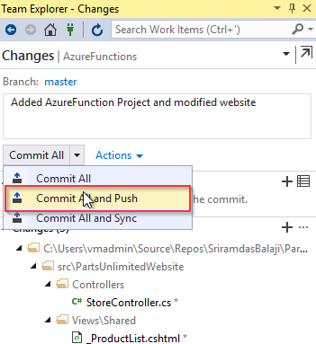
      
## Exercise 2: Build Azure Functions project in VSTS

## Exercise 6: Build and Deploy Azure Functions project in VSTS
In this exercise we will modify the Build and Release definitions to build Azure Functions project and deploy the azure function to the Function app which we created.

1.  In your VSTS account click on **Build and Release** hub and select **PartsUnlimkted-CI** and click on **Edit**

    

2. Add  **src\PartsUnlimited.AzureFunction\PartsUnlimited.AzureFunction.csproj** in Build Task and Publish Task as shown below

    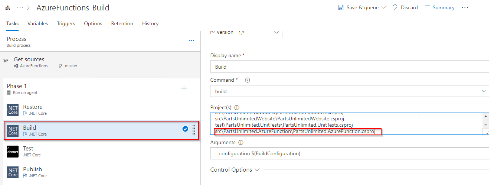
    

   We now included Azure functions project in build definition to Build and create a package for Azure Function Project.

3. Now click on **Save & Queue**. 
    You will see a build has been queued. Click on Build Number to see the progress of the build.

    
     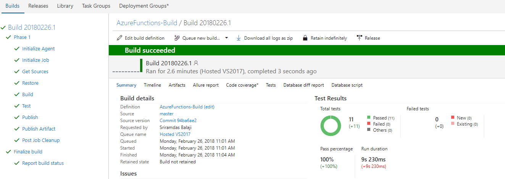

4. Once Build Succeeded Click on the **Releases** tab. Select **AzureFunctions_Deploy** release definition and click **Edit**

   

5. Click on **Dev** to view the deployment tasks in the definition

    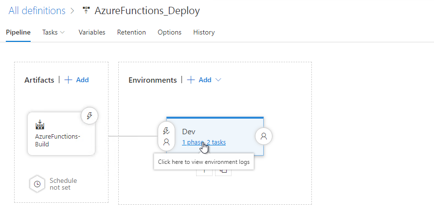

6. You have two tasks in the release definition.

   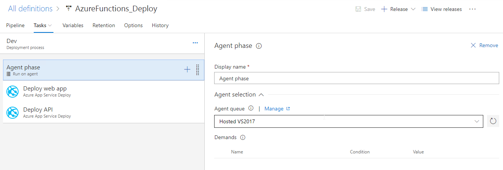

7. Now we will add one more task to deploy Azure Function to the Function App in Azure.
Click on **+** icon and add **Azure App Service deploy** Task

   

8. In the new task set the following parameters as shown in image

   > App Type: Function App

   > App Service Name: Function App which we have created in previuous exercise

   >Package or Folder: $(System.DefaultWorkingDirectory)/**/PartsUnlimited.AzureFunction.zip

   

   

9. Save the changes and Trigger the Release to deploy modified web site and the Azure function.

   

   You will see a Release has been queued. Click on the Release number to see the Release progress.

   

   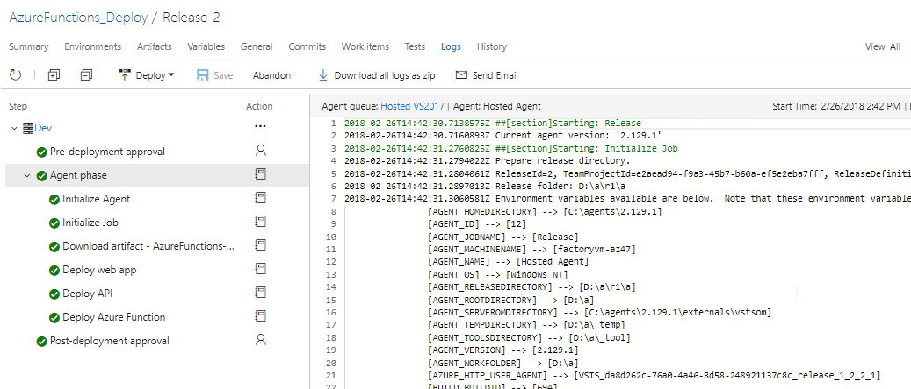

10. Once the Release is success, you can verify Website that you deployed calls the APIs.

## Exercise 7: Verify Website

1. Browse youe website and Navigate to **Oil** category without logging in, notice that products have V1 in their names, and showing Discount as 10% indicating they have been received from the original V1 controller which is for public users.


2. Log in as user Administrator@test.com with password **YouShouldChangeThisPassword1!** and navigate to Oil category again. You will notice that for this user Azure function routes the request to V2 controller (which is for Employees) and shows V2 products and Discount 30%

   

   

3. Log off from admin account and Create another account (public user) and login as that user. You will see V1 returned again.

   

   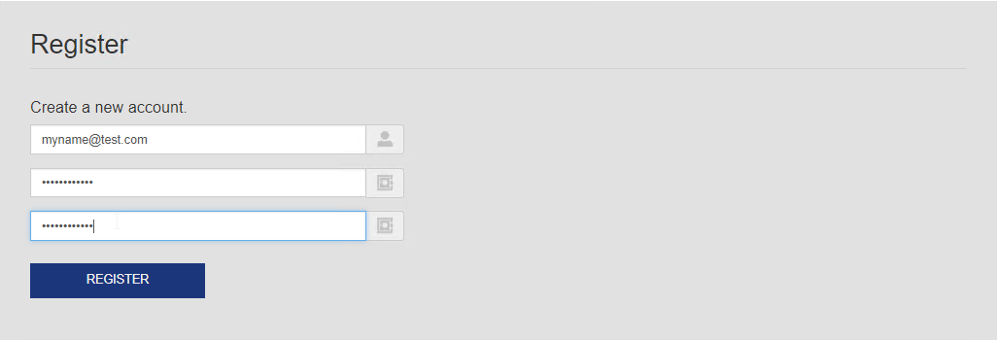

   

You have connected PartsUnlimited website to the Web API and used Azure function to retrieve data from either v1 or v2 of the API based on the user ID.
