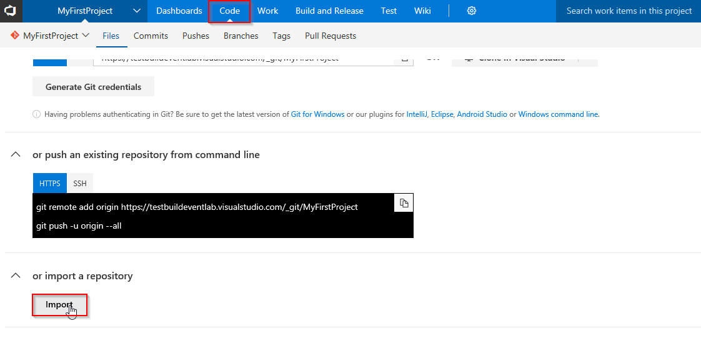
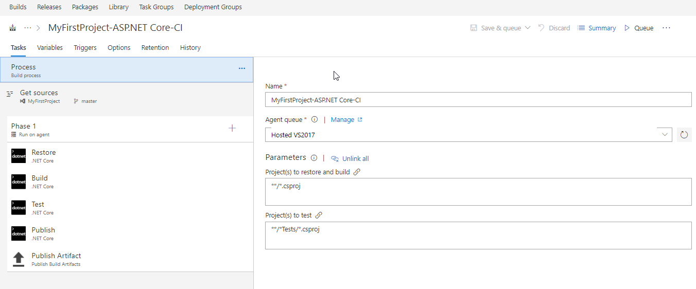
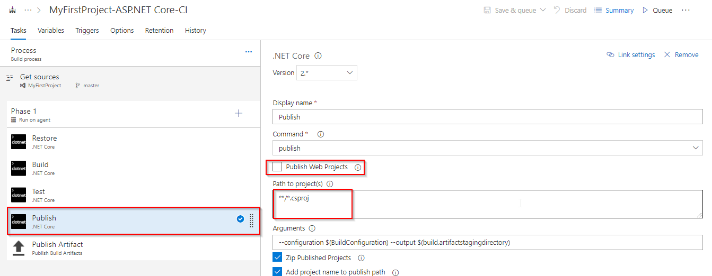
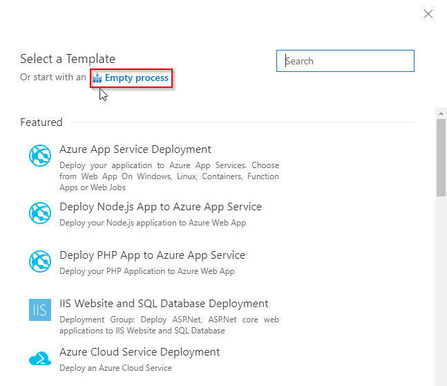
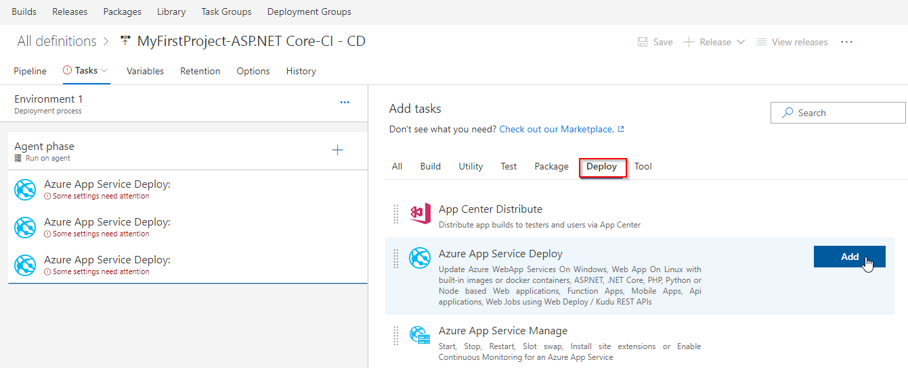
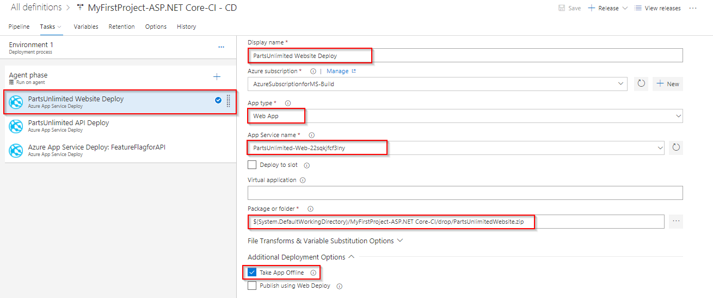
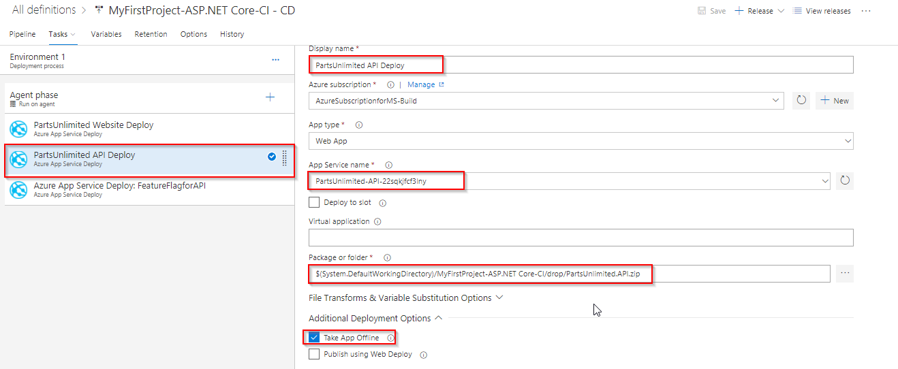
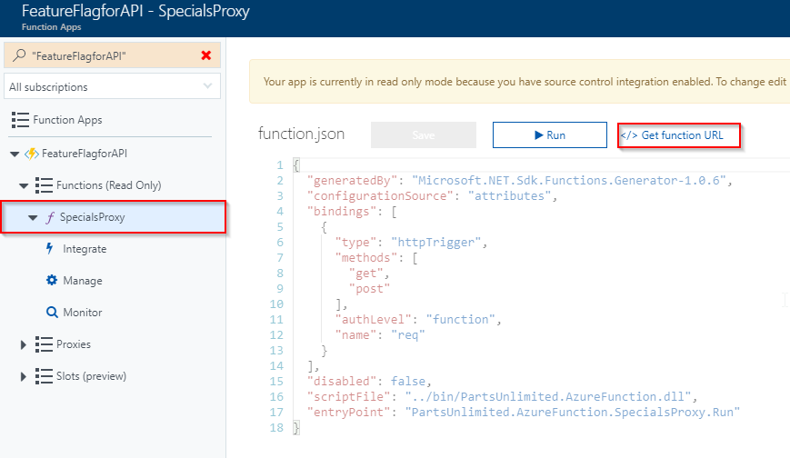

# Deploying Azure Functions using VSTS

## Overview
<!---
Azure Functions is a [serverless](https://azure.microsoft.com/overview/serverless-computing/) compute service that enables you to run code on-demand without having to explicitly provision or manage infrastructure. We can have Azure Functions to run a script or piece of code in response to a variety of events.

OR --->

**Azure Functions** is an event driven, compute-on-demand experience that extends the existing Azure application platform with capabilities to implement the code triggered by events occurring in Azure or third-party service as well as on-premises systems. Azure Functions allows developers to take action by connecting to data sources or messaging solutions thus making it easy to process and react to events. Developers can leverage Azure Functions to build HTTP-based API endpoints accessible by a wide range of applications, mobile and IoT devices.
 
**Scenario for the lab:** In this lab, we are using a fictional eCommerce website - PartsUnlimited. The PartsUnlimited team decides to roll out a new feature called **special discount for *employees of PartsUnlimited*** and a **different discount for *general users***. In this lab, we will implement a .Net Core Web API which will contain information about products and price (including discounts) and an Azure Functions which acts as a switching mechanism to return different (discount) information based on the user logged in to the application.

 ## What is covered in this lab?

 In this lab, you will

* Create a **Visual Studio Team Services** account
* Clone the PartsUnlimited project from GitHub
* Setup **Azure Function** in Azure portal
* Create a **Azure Functions** project in Visual Studio

* Setup a build definition in **Visual Studio Team Services** to build and test the code
* Configure a CD pipeline in **Visual Studio Team Services** for Website, API and Azure Functions

## Setting up the environment

### Part A: Provision the required Azure resources
1. Open Internet Explorer from the taskbar.
1. Navigate to [https://portal.azure.com](https://portal.azure.com)
1. Login with the following username and password 

   > Username: ++@lab.CloudPortalCredential(1).Username++

   > Password: ++@lab.CloudPortalCredential(1).Password++


1. Open a new tab in internet explorer and enter **https://goo.gl/octfDu**
to open an ARM template for creating required App Services.
1. For the **Resource Group** field, select **Use exisiting** and pick 
@lab.CloudResourceGroup(268).Name from the dropdown

1. Agree to the Terms and conditions and click **Purchase**. It should take approximately 1-2 minutes to provision the resources. Once the deployment is successful, you will see the resources as shown.
   
  
  ### Part B: Create Visual Studio Team Services account
  1. Navigate to https://www.visualstudio.com/team-services/ in a separate tab. Select **Get Started for Free**.
  1. You can use the same credentials used above to log in to Azure
     > Username: ++@lab.CloudPortalCredential(1).Username++

     > Password: ++@lab.CloudPortalCredential(1).Password++
  1. Provide a name for your Visual Studio Team Services account and click **Continue** to start the creation process
  1. In 1-2 minutes your account should be ready with a default project **MyFirstProject** created.

### Part C: Import and clone the project repository

1. Navigate to the **Code** hub. As you have not created any code yet you should see an empty repository. You can clone the remote repository to your local machine and start adding code. You can also import code from an another repository if you have existing code. For the purpose of this lab we will import it from **GitHub**.
1. Select **import** and enter https://github.com/sriramdasbalaji/AzureFunctionsBuild.git in the **Clone URL** field and select **Import**


     

      

1. When the import is complete, you can clone it and open it in Visual Studio(or any other IDE). We will use Visual Studio. Select **Clone** and then select **Clone in Visual Studio**.

   

1. When the code opens in Visual Studio, if you are prompted to sign into Visual Studio Team Services, use the same credentials(that you used above to create account) and select **Clone**

     


1. In Team Explorer under **Solutions**, you will see **PartsUnlimited.sln** available in the local git folder. Double click on **PartsUnlimited.sln** to open the solution.

     


## Exercise 1:  Set up an Azure Function

 In this exercise, you will create an **Azure Function App** from the Azure portal and then you will add code by creating an **Azure Functions project** in Visual Studio.

The [Azure Functions](https://azure.microsoft.com/en-in/services/functions/) created in this exercise will act as a switching proxy or mechanism to return different (discount) information based on the user logged in to the application.
Although we have used a simple condition here, this could also use more complex rules which could potentially be hidden behind another web api call.

1. Go back to the **Azure Portal**. Click the **Cloud Shell** button on the menu in the upper right of the Azure portal.

1. In **Cloud Shell** run the following commands to create a  **Storage account** and an **Azure Function**. Functions uses an **Azure Storage** to maintain state and other information about your functions.

   ```
    az storage account create --name <storage_name> --location westus --resource-group 
    @lab.CloudResourceGroup(268).Name --sku Standard_LRS
   ```

   ```
   az functionapp create --deployment-source-url https://github.com/sriramdasbalaji/azurefunctionsample --resource-group @lab.CloudResourceGroup(268).Name --consumption-plan-location westus --name FeatureFlagforAPI --storage-account  <storage_name>
   ```
   > [!ALERT]  In the above commands, substitute a globally unique storage account name where you see the **storage_name** placeholder. Storage account names must be between 3 and 24 characters in length and may contain numbers and lowercase letters only.
1. After running the above commands navigate to the @lab.CloudResourceGroup(268). You will see an **Azure Function App**.

    

   Select **FeatureFlagforAPI**. You will see Function App is deployed successfully and status of the app as **Running**

   

   
1. Now you will create **Azure Functions Project** in Visual Studio to write the code.  In this Azure Functions Project, you will write code to redirect the APIs based on the user login to return different (discount) information.

1. Open **Visual Studio**.
Right click on solution, select **Add** and select **New Project**.

   

1. Select **Cloud** under **Visual C#** category, select **Azure Functions** as the type of this project, enter **PartsUnlimited.AzureFunction** into the name field and append **\src** at the end of the location, then click **OK**.

     

     Select **HttpTrigger** template and click **OK**
    

    

1. Expand the **PartsUnlimited.AzureFunction** project, right click on **Function 1.cs** and select **Rename**. Rename the file as **SpecialsProxy**

    

1. Open the **SpecialsProxy.cs** file, replace the existing code with the following code.
   ```csharp
     using System;
     using System.Linq;
     using System.Net;
     using System.Net.Http;
     using System.Threading.Tasks;
     using Microsoft.Azure.WebJobs;
     using Microsoft.Azure.WebJobs.Extensions.Http;
     using Microsoft.Azure.WebJobs.Host;

     namespace PartsUnlimited.AzureFunction
    {
    public static class SpecialsProxy
    {
        [FunctionName("SpecialsProxy")]
        public static async Task<HttpResponseMessage> Run([HttpTrigger(AuthorizationLevel.Function, "get", "post", Route = null)]HttpRequestMessage req, TraceWriter log)
        {
            var userIdKey = req.GetQueryNameValuePairs().FirstOrDefault(q => string.Equals(q.Key, "UserId", StringComparison.OrdinalIgnoreCase));
            var userId = string.IsNullOrEmpty(userIdKey.Value) ? int.MaxValue : Convert.ToInt64(userIdKey.Value);
            var url = $"https://YourAPIAppServiceUrl.azurewebsites.net/api/{(userId > 10 ? "v1" : "v2")}/specials/GetSpecialsByUserId?id={userId}";
            using (HttpClient httpClient = new HttpClient())
            {
                return await httpClient.GetAsync(url);
            }
        }
    }
   }
   ```

   > Replace **YourAPIAppServiceUrl** in url variable with API app service name.This would like as **PartsUnlimited-API-XXXXXXX**

1. Open **StoreController.cs** from the path **PartsUnlimitedWebsite > Controllers > StoreController.cs**

     

1. Replace the code with the following code snippet
    ```csharp
    // Copyright (c) Microsoft. All rights reserved.
    // Licensed under the MIT license. See LICENSE file in the project root for full license information.
    using Microsoft.AspNetCore.Mvc;
    using Microsoft.Extensions.Caching.Memory;
    using PartsUnlimited.Models;
    using System;
    using System.Linq;
    using System.Collections.Generic;
    using System.Net.Http;
    using System.Threading.Tasks;
    using Newtonsoft.Json;
    namespace PartsUnlimited.Controllers
    {
    public class StoreController : Controller
    {
        private readonly IPartsUnlimitedContext _db;
        private readonly IMemoryCache _cache;

        public StoreController(IPartsUnlimitedContext context, IMemoryCache memoryCache)
        {
            _db = context;
            _cache = memoryCache;
        }

        //
        // GET: /Store/

        public IActionResult Index()
        {
            var category = _db.Categories.ToList();

            return View(category);
        }

        //
        // GET: /Store/Browse?category=Brakes

        public async Task<IActionResult> Browse(int categoryId)
        {
            // Retrieve category and its associated products from database
            // TODO [EF] Swap to native support for loading related data when available
            var categoryModel = _db.Categories.Single(g => g.CategoryId == categoryId);

            if (categoryModel.Name.ToLower().Equals("oil"))
            {
                var url = "https://partsunlimitefunctionapp.azurewebsites.net/api/SpecialsProxy?code=1wsG38iUPkMaclh0zmFpZoRewYs5usBLSlOkM5JaKIF4WvbklkeQYg==";
                if (HttpContext.User.Identity.IsAuthenticated)
                {
                    url += HttpContext.User.Identity.Name.Equals("Administrator@test.com") ? "&UserID=1" : "&UserID=50";
                }
                using (HttpClient client = new HttpClient())
                {
                    var jsonProducts = await client.GetStringAsync(url);
                    var products = JsonConvert.DeserializeObject<List<Product>>(jsonProducts);
                    foreach (Product product in products)
                    {
                        product.ProductId = _db.Products.First(a => a.SkuNumber == product.SkuNumber).ProductId;
                    }

                    categoryModel.Products = products;
                }
            }
            else
            {
                categoryModel.Products = _db.Products.Where(a => a.CategoryId == categoryModel.CategoryId).ToList();
            }
            return View(categoryModel);
        }
        public IActionResult Details(int id)
        {
            Product productData;

            productData = _db.Products.Single(a => a.ProductId == id);
            productData.Category = _db.Categories.Single(g => g.CategoryId == productData.CategoryId);


            return View(productData);
        }
    }
   }
   ```


1. Click  **Changes** in **Team Explorer** and push the changes to the server

      
      
## Exercise 2: Set up continuous integration
1. Go back to the **VSTS** portal.
 On the **Files** tab of the **Code** hub, click **Set up build**.
   
   

1. You are taken to the **Build and Release** hub in VSTS and asked to **Choose a template**.
In the right panel, select **ASP.NET Core**, and then click **Apply**.
   

   > Building  **Azure Functions Project** is same as building **ASP.NET Core** apps.
1. You now see all the tasks that were automatically added to the build definition by the template. These are the steps that will automatically run every time you push code changes.
    
      
1. Select **Publish** task. Uncheck the **Publish Web Projects** field and enter ****/*.csproj** in **Path to Projects** filed.


   
1. Click the **Triggers** tab in the build definition. Enable the **Continuous Integration** trigger. This will ensure that the build process is automatically triggered every time you commit a change to your repository.
      
    

1. Select **Save & queue** to kick off your first build. On the **Save build definition and queue** dialog, select **Save & queue**.

1. A new build is started. You'll see a link to the new build on the top of the page. Click the link to watch the new build as it happens. Wait for the build to complete and succeed before proceeding to the next section.


## Exercise 3: Setup continuous deployment

1. Once the build succeeds, click the **Release** action on the build summary page.
  

1. In the **Select a Template** panel, click the **Empty Process**.
     

1. Select the artifact trigger and make sure the **Continuous deployment trigger** is enabled.

     

1. Click **Tasks**, and then select **Add task to the Phase** to add the deployment tasks.

    

1. In **Add tasks** panel under **Deploy** section select **Azure App Service Deployment** task. Add this task three times.

   

   > Configure the inputs for the **Deploy Azure App Service** tasks in the release definition. First, select the name of the **Azure subscription**  if there is an **Authorize** button next to the input, click on it to authorize VSTS to connect to your Azure subscription
1. Select the first **Azure App Service Deployment** task and configure the inputs as shown below.
     

   This task is to deploy **PartsUnlimited Website**.

1. Select the second task and configure the inputs as shown below.

   
 This task is to deploy **PartsUnlimited APIs**.
1. Select the third task and configure the inputs  as shown below.

   
  This task is to deploy **PartsUnlimited Azure Function**.

1. Click **Save**. In the Save dialog box, click **OK**. To test the release definition, click **Release** and then **Create Release**.
  
   

   On the Create new release dialog box, click **Create**.

1. You will notice a new release being created. Select the link to navigate to the release.

   
You can watch the live logs for the deployment as it happens. Wait for the release to be deployed to the Azure web app.
    

 Wait for the release to complete and succeed before proceeding to the next section.

## Exercise 4: Update the Azure Function url in site.
1. Go back to the **Azure Portal**. Select **FeatureflagforAPI** Azure Function app in **@lab.CloudResourceGroup(268).Name**


1. Select **SpecialsProxy** in Functions and click **Get Function Url**

   

1. **Copy** the function url.

   
1. Now open **Visual Studio**. Navigate to **StoreController.cs** from the path **PartsUnlimitedWebsite > Controllers > StoreController.cs**

1. In **StoreController.cs** replace the **url**  variable in line 46 with the **Function url** copied in previuous step.
 

1. Click **Changes** in Team Explorer and **Commit&Push** the changes to the server

1. This change triggers a CI build in VSTS, and when the build completes, it triggers an automatic deployment to Azure app services configured in **Release**


## Exercise 5: Verify the website

1. Once deployment has completed, go to the **Azure portal**. In **
@lab.CloudResourceGroup(268).Name** resource group select **PartsUnlimited-Web-xxxxx** and click **Browse**

1. You will see the website as shown below. Navigate to **Oil** category, notice that products are showing Discount as **10%**.

   

1. Now log in as user **Administrator@test.com** with password **YouShouldChangeThisPassword1!** and navigate to **Oil** category again. You will notice that for this user **Azure function** routes the request to other API and shows Discount as **30%**

   

   
   
   You have connected PartsUnlimited website to the Web API and used Azure function to retrieve data from either v1 or v2 of the API based on the user ID.
